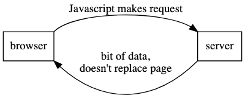

# How the Web Works

In addition to these notes, MDN has a great article about [How the Internet Works](https://developer.mozilla.org/en-US/docs/Learn/Common_questions/Web_mechanics/How_does_the_Internet_work)

## Key Vocab

A **network** is a set of computers that can intercommunicate. (LAN/School network/etc.)

The **Internet** is just a very large **network**, and is made up of a lot of smaller **networks**. It's used for many things, such as the **Web**, VOIP, Email, etc.

The **\*World Wide Web** is an information system where documents and other web resources, identified by URLs, which is accessible via the internet.

## Networks

With just a few computers, it's simple to connect them to each other, but once you get 3 - 4+, this becomes burdensome! Thankfully there's a special computer, called a **router** which acts as a hub and facilitates traffic within a network.

Networks don't simply stop here though, as **routers** can connect to other **routers**, making a network of networks.

Suddenly, we went from 1 or two computers to potentially thousands. Thankfully, **IP Addresses** are here to save the day!

### IP Address

An **IP Address** is a unique identifier that identifies a given computer on a given network.

Types of **IP Addresses**:

- IPv4 (172.1.23.242)
  - 4 numbers (from 0 - 255) separated by `.`
  - There are a lot of combinations, but it doesn't cut it in the current day!
- IPv6 (2001:0DF1:9992:FE01::)
  - Eight 4-digit Hexadecimal Numbers separated by `:`
  - If remaining sets are all 0's, they can be omitted and end with `::`

### DNS

We often talk to servers by **hostname** (aka `google.com`).

This is facilitated through **DNS**, or **Domain Name System**. It's kind of like the phonebook of the web. (It takes **hostnames** and finds their corresponding **IP Address**).

#### localhost

**localhost** is a special **IP Address** that refers to the computer that you are on. It is always `127.0.0.1`.

Often in development, we'll need to start a server on our own machine, and for that we'll use **localhost**.

### URL Anatomy

There are many parts to a URL. Given the following URL:
`https://google.com/some/page.html?q=cats`

- Protocol (`https`)
  - Protocols are conventions/ways of communicating between computers. `https` is pretty much the standard.
- Hostname (`google.com`)
  - Human readable name that maps to an **IP Address**
- Ports
  - Note, there is no port in the above URL! Services tend to have a default port, so we don't need to specify this.
  - HTTP - Port 80, HTTPS - Port - 443
  - Every server has 65,365 available ports!
- Resource (`/some/page.html`)
  - Used to specify which Resource we're asking for. (/search for a google search)
- Query (`?q=cats`)
  - Optional `key=value` pairs that provide extra information, such as search query, ranges in an API call, etc.
  - You can have multiple queryies, and they're separated by an `&` (`?q=cats&sort=featured`)

### HTTP

**HTTP** is a protocol used for communicating between clients and servers. It's important to have a set protocol so that the client knows how to send requests and the server knows how to respond!

A **Request** is sent by a client to a server.

The **Server** will then often do some kind of work, such as Wikipedia finding the page of the day.

The server will then send a **Response** to the client.

You can view **Requests** and **Responses** in the Chrome Console under the `Network` tab.

#### Requests

Parts of a request:

- Method (ex. **GET** or **POST**)
- HTTP Protocol version (Usually 1.1)
- Resource URL
- Headers
  - hostname you're asking about
  - current date
  - desired language
  - and many more!

#### Responses

Parts of a response:

- HTTP Protocol version (Usually 1.1)
- Response Status Code (200, 404, etc)
- Headers
  - Content Type (Usually text/html for web pages)
  - Date/Time
  - Cookies
  - Last Modified date
  - And much more!

#### Response Codes

- 2xx - Success
  - 200 (OK)
- 3xx - Redirects
  - 304 (Not Modified)
- 4xx - Client Errors
  - 404 (Not Found)
- 5xx - Server Errors
  - 500 (Sever Internal Problem)

#### Methods

Most commonly, **GET** and **POST**, are used to indicate what you're trying to do.

**GET**: Requests without side effects (i.e., don't change server data only retrieve it.)

**POST**: Requests **with** side effects. (Changing data on server, like posting a comment.)

# Setting up a Server

This is a bit early, but you can start a server from the cmd line in your current directory:

```
python3 -m http.server
```

(Technically, `Live Server` does the same thing, so for now we don't need to worry about this!)

# APIs

**APIs** (Application programming interface) are interfaces that allow code to interact with an application, computer, hardware, etc. We'll mainly use Web APIs, but there are apis for robots, etc.

Some examples

- Twitter API (give me all tweets that mention "ice cream")
- Facebook API, (send me the current user's profile photo)
- Weather API, (give me weather for location)
- Reddit API, (what is the current top post)

## Data Formats

There are two main formats (well, one): **XML** and **JSON**

### XML

**XML** used to be the primary format and looks something like this:

```
<person>
  <name>Elie</name>
  <favoriteColor>purple</favoriteColor>
  <age>24</age>
</person>
```

We likely won't ever encounter XML, unless we're working with a very old API.

### JSON

**JSON** (Javascript Object Notation) is preferred, and makes it super easy to parse and convert to and from JSON and JavaScript Objects.

```
{
  "person": {
    "name": "Elie",
    "favoriteColor": "purple",
    "age": 24,
  }
}
```

# AJAX

**AJAX** (Asyncronous JavaScript and XML) is the main method used for performing HTTP Requests. (Note, it still uses **JSON**, it's just an old name from when **XML** was prevalent.)

In traditional browser requests, such as a form submission, the browser GETs an entire resource and replaces the current resource with it. This causes a page refresh, which isn't necessarily a bad thing but sometimes you only want to grab a portion of a page and update the existing one with it.

With **AJAX** we can use JavaScript to write asyncronous code that fetches things from the server and then updates on the page when the request is finished.

**Regular Request**


**AJAX Request**


AJAX Pros:

- No need to reload for small changes
  - Leads to fewer full page loads
- Interactive Web Sites
- Less info across network
  - API can return JSON instead of full HTML pages.

AJAX Cons:

- AJAX sites can be hard to make compatible with Accessibility options like screen readers.
- Dynamic design can make it difficult to bookmark and return to specific application states.
- SEO can be impacted as most Web Crawlers don't execute JS code. (Google does pay attention to JS though.)

## XMLHttp Overview

**XMLHttpRequest** (XHR) is the built in way to make HTTP requests.

```
const firstReq = new XMLHttpRequest();
firstReq.addEventListener('load', function () {
  const data = JSON.parse(this.responseText);
  for (let planet of data.results) {
    console.log(planet.name);
  }
});
firstReq.addEventListener('error', () => {
  console.log('ERROR!');
});
firstReq.open('GET', 'https://swapi.dev/api/planets');
firstReq.send();
console.log('Sending Request.....')
```

The main complication here is with executing code after the requests finishes. What if we wanted to load page 2, and then 3, 4, 5? We'd have a long chain of nested callbacks/eventListeners.

## Axios

Thankfully, there are libraries built on top of **XHR** that allow us to do the same thing with far less code!

In the course, we'll use **Axios**, though alternatives like **fetch** do exist.

### Setup

For now, we can just use a CDN.

```
<script src="https://unpkg.com/axios/dist/axios.min.js"></script>
```

### Making a Request

Compared to **XHR**, an **axios** request is nice and simple!

```
const response = axios.get('https://swapi.dev/api/planets')
console.log(response);
```

Unlike **XHR**, response is a new thing called a **Promise**. We're skipping over them for now, but they'll be covered in detail later in the course.

In simple terms, a **Promise** is a placeholder for a future value. Notice that the above code prints out a **pending** promise, meaning the data isn't there yet.

### Asyncronicity

Since **Promises** are returned immediately, we usually want to wait until it has a value, whether that's a success or a failure.

We achieve that in JS with the **Async/Await** pattern.

```
async function getData() {
  const response = await axios.get('https://swapi.dev/api/planets');
  console.log(response);
}
getData();
```

**Async** functions are special functions that always return a **Promise**. It also enables us to use the **await** keyword, which pauses code execution **inside of the async function** until the call finishes. Notice how how response isn't immediately logged and is a completed promise and has all of its data.

**Axios** also does something handy and parses the HTML into an object for us! **response** is a JS Object, and not pure JSON! Compared to XHR, here's our equivalent **axios** code:

```
async function getData() {
  const response = await axios.get('https://swapi.dev/api/planets');

  for (let planet of response.data.results) {
    console.log(planet.name)
  }
}
getData();
```
To further touch on await, it can be used on any **async** function, including those we define ourselves.
```
async function getUsers(token) {
  const res = await axios.get('https://hack-or-snooze-v3.herokuapp.com/users', {
    params: { token },
  });
  console.log(res);
}

async function login(username, password) {
  const res = await axios.post(
    'https://hack-or-snooze-v3.herokuapp.com/login',
    { user: { username, password } }
  );
  return res.data.token;
}

async function getUsersWithAuth() {
  const token = await login('gavvy', '2348jkls389');
  getUsers(token);
}
```

### Handling Multiple Requests

Thanks to **async/await** we can avoid nesting and run our asyncronous code as if it was syncronous!

```
async function getData() {
  // First Request
  const response = await axios.get('https://swapi.dev/api/planets');
  // Remember destructuring? Yeah, USE IT!
  const { next, results } = response.data
  loopAndLog(results)

  // Second Request
  const secResponse = await axios.get(next)
  loopAndLog(secResponse.data.results);
}

function loopAndLog(arr) {
  for (let item of arr) {
    console.log(item.name);
  }
}

getData();
```

### Error Handling

Remember when we talked about **try/catch**? Now we finally get to use it!

```
async function getDogByBreed(breed) {
  try {
    const res = await axios.get(`https://dog.ceo/api/breed/${breed}/images/random`)
    const img = document.querySelector('#dog')
    img.src = res.data.message;
  } catch (e) {
    alert('Breed not found!')
    getRandomDog();
  }
}
```

### GET Params

The full syntax for `.get()` is `axios.get(url, [config])`. So what is that `[config]`? We wont touch on all of the options, but the most important one is `params`.

Without params, if we wanted to add query parameters to the url it'd look like this:

```
const res = axios.get('https://icanhazdadjoke.com/search?term=pirate')
```

The issue, is that sometimes special characters aren't legal url characters and are replaced with `%20` or others. That's what params are for!

```
async function getJoke(category) {
  let res = await axios.get(`https://api.chucknorris.io/jokes/random`, {
    params: { category },
  });
  console.log(res.data.value);
}
```

### POST
`axios.post(url, [data,], [config,])`

```
async function createUser() {
  const res = await axios.post('https://reqres.in/api/users', {
    username: 'ButtersTheChicken',
    email: 'butters@gmail.com',
    age: 1,
  });
  console.log(res);
}
```