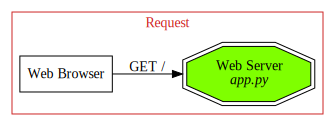
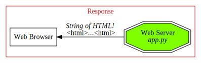

# Web Frameworks

A **Web Server** is a program that's running on a machine and waiting for a web request.




Throughout the course, we'll be using Python with **Flask** to build our own web servers.

Flask, and web frameworks in general, give us functions/classes/etc. that make it easier / quicker to specify what kind of request you listen for and how to customize your response. (**Django** is another popular web framework.)

Common requests that web frameworks help with:

-   Handle Web Requests
-   Produce dynamic HTML.(i.e. visiting a page could be different based on time of day, who's logged in, etc.)
-   Handle forms
-   Handle cookies
-   Connect to databases
-   Authentication
-   Caching pages for performance

## Flask vs Django

Flask and Django are pretty much even in terms of market share. Django is nice in that it does a lot of the heavy lifiting making it easier to write apps quickly and effectively with minimal code.

Flask, on the other hand, is more minimalistic which is better suited to learning. (No magic behind the scenes, you'll have to do a lot of the work yourself!)

# Flask

## Setup

### Installing Flask

As always, we're going to make sure to make a `venv`!

```
python3 -m venv venv
source ven/bin/activate
pip install flask
```

### Making a server

In our project directory, we'll make an `app.py` file and add Flask!

```
from flask import Flask

app = Flask(__name__)
```

`app` is the Application Object, which will be use in **every** flask app.

To run the server, move back of to `terminal` and type `flask run`

To shutdown the server, simply hit `ctrl + c`.

### Environmental Variables

#### FLASK_APP

By default, Flask is looking for a file called `app.py`. While this is standard convention, if you wanted to have a different file name you can run:

```
FLASK_APP=my_filename.py flask run
```

`FLASK_APP` is an **environmental variable** which lets us customize how things run. (Another common is setting it to `debug` mode.)

#### FLASK_ENV / FLASK DEBUG

<blockquote>Note: In Flask 2.2, FLASK_ENV was deprecated for FLASK_DEBUG. Keeping both in the code incase I'm ever using an older version for the course.</blockquote>

In development mode, we get a handy debugger and the server reloads whenever codes changes. (This is handy!)

To run in debug mode, we'll use an **environmental variable**.

```
FLASK_ENV=development flask run
```

Thankfully, we can set that variable in out `venv` so we don't need to type it for every run.

```
export FLASK_ENV=development
```

<blockquote>Note, this isn't a permanant change. It will need to be reset everytime the Terminal is opened!</blockquote>

##### Configuring Bash Shell

We can take things a step further and and set this in `Ubuntu` itself, so that it is always set by default. (99.99% of the time we want to run in debug. If we ever want to run production, we can just manually do so.)

We can do this by adding `export FLASK_DEBUG=1` to `.profile`. (Note, the videos use `FLASK_ENV=development` which was deprecated in Flask 2.2.)

```
cd ~
code .profile

// ADD THIS LINE
export FLASK_DEBUG=1
```

If you ever want to run in production you can use

```
FLASK_DEBUG=0 flask run
```

## Routes

Remember Compose Navigation that was basically web urls?? Well, surprise. It's Web Development!

### GET Requests

We can define a route with a decorator.

```
@app.route('/route')
def say_hello():
    return 'Hello there!'
```

This is saying: When someone asks for '/route', run this function. Thanks to Flask, that simple `return` is enough to display something on the page.

Flask does a lot of background work to create the `HTTPResponse`, ect.

#### HTML

Later, we'll see how to build dynamic templates, but we can level up our page a little bit by adding some manually written `HTML`.

```
@app.route('/hello')
def say_hello():
    html = """
    <html>
        <body>
            <h1>Hello!</h1>
            <p>This is the hello page</p>
        </body>
    </html>
"""
    return html
```

#### Root route

The **root** is the homepage of the application. (`localhost:5000`, `google.com`, etc.) Without specifying this, the user gets a 404 on the homepage! Thankfully, that's an easy fix with Flask:

```
@app.route('/')
def home_page():
    html = """
    <html>
        <body>
            <h1>Home Page</h1>
            <p>Welcome to my simple app!</p>
            <a href='/hello'>Go to Hello page</a>
        </body>
    </html>
"""
    return html
```

Notice how the `route` for the root page is simple `'/'`.

#### Query Parameters

Flask has an easy way to access query parameters, using the `request` class.

```
from flask import request

@app.route('/search')
def search():
    term = request.args["term"]
    sort = request.args['sort']
    return f"<h1>Search Results For: {term}</h1> <p>Sorting by: {sort}</p>"
```

`request.args` is a `dict` like object, so we can access the param we're looking for with `[]` syntax. The url can add any number of query parameters, and anything we don't ask for will be ignored. However, if you ask for a param that isn't sent you'll get an error!

### POST Requests

Making a POST request is pretty similar to GET, we just supply `methods=["POST"]` to the route.

```
@app.route('/post', methods=["POST"])
def post_demo():
    return "You made a post request"
```

To test out the POST request, try using a curl command! (Open a new tab in Terminal!)

```
curl -X POST http://127.0.0.1:5000/post
```

You can add multiple methods to the list so that your endpoint can listen to GET / POST / DELETE / etc. Since we're just starting out though, we'll separate them.

```
@app.route('/post', methods=["POST"])
def post_demo():
    return "You made a post request"


@app.route('/post', methods=["GET"])
def get_demo():
    return "You made a get request"
```

#### POST with a Form

Using `curl` is well and good, but we're a web developer! Let's make a live form to send some data!

We'll start by defining a `GET` request that renders a form.

```
@app.route('/add-comment')
def add_comment_form():
    return """
        <h1>Add Comment:</h1>
        <form method="POST">
            <input type='text' placeholder='comment' name='comment'/>
            <input type='text' placeholder='username' name='username'/>
            <button>Submit</button>
        </form>
    """
```

Sweet! Now upon submitting our form, the `value` of the input will be saved in `comment`. But how do we access it? `request` has a `form` attribute! (Like `args`, it's also a `dict` like object.)

```
@app.route("/add-comment", methods=["POST"])
def save_comment():
    comment = request.form["comment"]
    username = request.form["username"]

    return f"""
        <h1>Saved your comment!</h1>
        <ul>
            <li>Username: {username}</li>
            <li>Comment: {comment}</li>
        </ul>
    """
```

### URL Parameters

Imagine we had a `/user` endpoint. If we had 1000 users, we'd need 1000 different endpoints! Thankfully, variables save the day.

To write a variable in a route, we surround it in `<>` and Flask will automatically pass it into our `view function`

```
@app.route('/r/<subreddit>')
def show_subreddit(subreddit):
    return f"""
        <h1>Browsing the {subreddit} Subreddit</h1>
    """
```

Note, that the variables that are returned are **always** `str` by default. Thankfully, we can easily tell Flask what type our variable should be. (`route(/path/<type:variable)`)

```
POSTS = {
    1: "I like chicken tenders",
    2: "I hate mayo!",
    3: "Double rainbow all the way",
    4: "YOLO OMG (kill me)",
}

@app.route('/posts/<int:id>')
def find_post(id):
    post = POSTS.get(id, "Post not found")
    return f"""<p>{post}</p>"""
```

<blockquote> Note, if you tried to go to `/posts/chicken`, then you'll get a 404 error. Flask will only run your view function if the provided URL Parameter matches your specified type!<blockquote>

#### Multiple Parameters

While you probably don't want too many, you can add multiple URL parameters.

```
@app.route("/r/<subreddit>/comments/<int:post_id>")
def show_comemnts(subreddit, post_id):
    return (
        f"<h1>View comemnts for post with id: {post_id} from the {subreddit} Subreddit"
    )
```

### URL Params vs Query Params

`URL Parameters` should be things that are more like the 'subject' of the page, like `/user/<username>`. `username` refers to the profile page for a specific user.

`Query Parameters` should be things that are modifiers or provide extra information about the page in question, like `/search?sort=top`. `search` is the main page but `sort` defines how the information should be organized within that page.

## Jinja

**Jinja** is used to make `HTML` templates, which will replace our hardcoded `str`s we've used so far in our `view` functions.

Some advantages of templates:

-   Produce `HTML`
-   Allows dynamic responses
    -   Can use variables passed from views
    -   For loops, if/else statements
-   Inherit from other templates to minimize repetition

### Flask Debug Toolbar

Before deep diving into `Jinja`, we're taking a small detour.

```
pip3 install flask-debugtoolbar
```

And to include it:

```
from flask_debugtoolbar import DebugToolbarExtension

app = Flask(__name__)
app.config['SECRET_KEY'] = "chickensarecool"
debug = DebugToolbarExtension(app)
```

For now, our 'secret key' isn't very secret, but we'll touch on that more later.

Refresh the page, and you'll see an awesome toolbar with a ton of info! (Note, this is only available when using `templates`)

### Templates

Flask is looking for a specific directory named `templates`.

```
project-directory/
    venv/
    app.py
    templates/
        template.html
        ...
```

#### Rendering templates

Once we have our template, we can easily show it by importing Flask's `render_template`.

```
from flask import render_template

@app.route('/')
def index():
    return render_template('hello.html')
```

### Dynamic Templates

#### Variables

With Jinja, we can use `{{ variable }}` to set dynamic content within our `HTML` templates!

```
<h1>This is page {{ 1 + 1}}</h1> // This is page 2
```

We'll create a new endpoint, '/lucky' to display this number. To provide the variable, we simply pass it to `render_template` after the template file.

```
// app.py
@app.route('/lucky')
def show_lucky_num():
    """Example of a simple dynamic template"""
    num = randint(1, 20)

    return render_template('lucky.html', lucky_num = num, msg = "You are so lucky!")

// lucky.html
<!DOCTYPE html>
<html lang="en">
<head>
    <meta charset="UTF-8">
    <meta name="viewport" content="width=device-width, initial-scale=1.0">
    <title>Lucky Number</title>
</head>
<body>
    <h1>Your lucky number is: {{ lucky_num }}</h1>
    <p>{{ msg }}</p>
</body>
</html>
```

<blockquote>Make sure the variable name is the same in your render_template call AND your html template.</blockquote>

#### Conditional Logic

Jinja has a seperate syntax for conditions that involves wrapping your statements in ``

```
// lucky.html

<h2>That's my lucky number too!</h2>

<h2>{{lucky_num}} is not my lucky number</h2>

```

The `else` block is optional, but you must include the `endif` block!

#### Looping

Loops use the same `` syntax, with just a few changes:

```

<h1>{{char}}.</h1>

```

#### Template Inheritance

In most cases, a lot of your pages are going to have the same content. (i.e. footer, nav bar, etc.)

We'll start out by making a `base.html` file, which will house all of the boilerplate. (links, scripts, stylesheets, `<!DOCTYPE html>`, etc)

For everything that we want to by dynamic/inherited, we'll wrap it in ` ` tags.

```
// base.html
<!DOCTYPE html>
<html lang="en">
    <head>
        <meta charset="UTF-8" />
        <meta name="viewport" content="width=device-width, initial-scale=1.0" />
        <title>{% block title $}{% endblock $}</title>
    </head>
    <body>
        <nav>
            <a href="">Pretend I am a navbar!</a>
        </nav>
         
        <footer>Pretend I am a footer!</footer>
    </body>
</html>

```

Now that we can sub out our `content` block, how do we actually do that in child templates? We'll actually be stripping out most of the `html`, and only writing what's unique to that template!

```
// greet_2.html


Greeter


    <h1>Hi there, {{username}}!</h1>
    
    <h2>Ok, here are compliments:</h2>
    <ul>
        
        <li>{{compliment}}</li>
        
    </ul>
    

```

Here, we've included the `base.html` template, and definied what should go inside of the `title` and `content` blocks.

### Static Resources

**Static Resources** are things like Stylesheets, JS files, etc. (These aren't being dynamically generated. They generally stay the same.)

When working with Flask we put out these files in the `/static` folder. (We link them directly, so the name can be different, but `/static` is fairly common.)

```
project-directory/
    venv/
    app.py
    templates/
        hello.html
    static/
        my-css.css
        my-script.js
```

Then, depending on the usecase, you can link these in your `base.html` template, or use it only in specific templates.

## Flask Tools

This will be a collection of topics involving useful things that Flask provides.

### Redirecting

Redirecting use cases:

-   User login successful, redirect to new page.
-   User visits old URL, redirect to new URL.

#### Initiating a Redirect

Flask gives us a handy `redirect()` method for this very use case.

```
from flask import redirect

@app.route("/old-home-page")
def redirect_to_home():
    """Redirect to new homepage"""

    return redirect("/")

```

Note: The Flask Debug Toolbar is **explicit** in redirects, in that it takes you to a redirect page that allows you to click to the new link. (Useful for debugging.) To disable this and simply redirect as normal:

```
// app.py

app.config['DEGUB_TB_INTERCEPT_REDIRECTS'] = False
```

#### Common Redirect Pattern: POST to GET

If you serve HTML from a `POST` request, when you refresh the page your browser asks if you want to resend the `POST`.

To avoid this, we can have our `POST` redirect to a different `GET` request.

```
@app.route('/movies')
def show_all_movies():
    """Show a list of all movies in fake DB"""

    return render_template('movies.html', movies=MOVIES)


@app.route('/movies/new', methods=["POST"])
def add_movie():
    title = request.form['title']

    # Add to fake DB
    MOVIES.append(title)

    return redirect('/movies')
```

In the above example, `/movies` has a form to add a new movie. The form submission goes to `/movies/new`, which adds the movie to our `database` and then redirects back to `/movies`.

#### Message Flashing / Flash Messaging

Message Flashing allows us to convey one time information to the user. Using the above example, after adding a movie to the `database`, you might want to send the user a success / error message, depending on the outcome.

We can't really hardcode this into our template, as it'll always be visible. To solve this issue, Flask has a function, called `flash()` which will display info on **the next page load only**.

Here's an improved version of `/movies/new` with `flash()`

```
// app.py
from flask import flash

@app.route('/movies/new', methods=["POST"])
def add_movie():
    title = request.form['title']

    # Add to fake DB
    if title in MOVIES:
        flash("Movie already exists")
    else:
        MOVIES.add(title)
        flash('Created your movie')
    return redirect('/movies')

// base.html
<section class="messages">
    
        <p>{{msg}}</p>
    
</section>
```

##### Flash Categories

`flash()` also takes another `arg` that sets the category, which you can later access in your jinja template.

```
<section class="messages">
    
        <p class="{{category}}">{{msg}}</p>
    
</section>
```

##### Jinja With

We've got one last improvement, and that's to only show `section` messages when there are flashed messages.

To do that, we can use Jinja's `with` block.

```
<main id="content">
    

    
        <section class="messages">
            
                <p class="{{category}}">{{msg}}</p>
            
        </section>
    

    
    
</main>
```

### Flask Debugging

When the FDT detects an error, it gives us a traceback. We can click/expand parts, but we can also open up an interactive console by clicking on the `terminal` icon on the far right.

This will ask for a `pin`, which you can find in your terminal when you start your server.

### Python Debugging

Python has a built in Debugger, `pdb` that can help debug code.

| Key |           Command           |
| :-: | :-------------------------: |
|  ?  |          Get Help           |
|  l  |    List code at location    |
|  p  |      Print expression       |
| pp  |   Pretty Print Expression   |
|  n  |    Next Line (Step Over)    |
|  s  |   Step Into Function Call   |
|  r  |  Return from Function Call  |
|  c  | Continue to next Breakpoint |
|  w  |  Print "frame" (Location)   |
|  q  |        Quit Debugger        |

You can set 'breakpoints' anywhere in your code!

```
# Add to fake DB
    if title in MOVIES:
        flash("Movie already exists", 'error')
    else:
        MOVIES.add(title)
        flash('Created your movie', 'success')
    
    import pdb
    pdb.set_trace()

    return redirect('/movies')
```

<blockquote>It's good practice to import right before setting the trace. That way, you remember to remove your import when you remove the trace!</blockquote>

### Returning JSON
Flask has a handy method `jsonify()` that will convert valid JSON objects (dicts, lists) into JSON and will also update the `content-type` to `application/json`.

```
from flask import jsonify

@app.route('/movies/json')
def get_movies_json():

    return jsonify(list(MOVIES))
```

## Handling State
`HTTP` is **stateless** meaning it remembers nothing. If we want to persist state between requests/visits, we need to use other tools.

Some examples of ways to save state:
- Passing info in a query param / POST form hidden field
    - `/step-zero?fav-color=blue` -> `/step-one?fav-color=blue`
- Keeping info in URL Path
    - `/fav-color/blue/step-zero` -> `/fav-color/blue/step-one`
- Using JS `localStorage` API
    - This is nice, but only JS has access to it; you can't access this on the server.
    - Useful for SPAs or AJAX heavy apps.
- Using Cookies / Sessions.
    - This is what we'll talk about!

### Cookies
Cookies are a way to store small bits on info in the client (browser). They are `name/string-value` pairs that are sent to the server with each `request`. Later on we'll be using `Flask Session` to handle cookies, but for now we'll do an overview of how to work with them manually.

#### Reading Cookies
Similar to `URL Params` and `Form Data`, we can access cookeis via Flask's `request` object.

```
@app.before_request
def print_cookies():
    """For every single request that comes in, print out request.cookies (printed to terminal)"""
    print("*********************")
    print(request.cookies)
    print("*********************")
```
Note the special header `@app.before_request`. This will run the provided function before **every** request in the Flask app!

Conveniently, this is also accessible in our Jinja Templates; we don't need to pass it in at all!

```
// state-debug.html


  <fieldset>
    <label>Cookies Received By Flask</label>
    <ul>
      
        <li>{{ name }} = "{{ value }}"</li>
      
    </ul>
  </fieldset>

```

#### Setting Cookies
So far, we've been letting Flask handle the full creation of our `response` objects, and have simpley been returning templates from our `view` functions. In order to set cookies, we'll need to make that response ourselves, with `make_resposne()`.

```
@app.route("/demo")
def res_demo():
    content = "<h1>HELLO!!</h1>"
    res = make_response(content)
    res.set_cookie("jolly_rancher_flavor", "grape")
    return res
```

#### Cookie Options
You can add extra parameters to your cookies to customize how they work.

- Expiration: How long should the browser remember?
    - Default is until the browser is closed (**session cookie**).
- Domain: Which domains should the cookie be sent to?
    - Send only to `books.site.com` or everything at `site.com`?
- HttpOnly: HTTP-only cookies aren't accessible via any kind of JS
    - Useful for cookies containing server side info.

### SessionStorage
Not to be confused with `Flask Session`, `SessionStorage` is another way of saving state. (It's similar to `LocalStorage`, except it only lasts for the current session. i.e until the browser/tab is closed.)

We aren't really going into how to use it. (It's similar to `LocalStorage`, so it's not overly complicated.) The main reason for bringing it up is to avoid confusion between this and `Flask Session`.

### Flask Session
Using cookies on their own can be a little tricky. Values can only be strings, so if you needed to store a more complex data structure, like a list, you'd need to convert to and from str, etc.

`Session` makes things a bit easier by preserving types, that is a list stays a list, and is also signed, meaning the users can't modify the data like you can with cookies.

To get started with `Session` we need to import it and set a secret key. (We've been setting secret keys already!)

```
from flask import Flask, session

app = Flask(__name__)
app.config["SECRET_KEY"] = "4534gdghjk5d#$RGR^HDG"
```

#### Accessing Session
Now that we're all setup, we can start accessing the `session` object. It works much like a dictionary, so reading/writing is easy!

```
session["key"] = "new_value"
sesssion["key"] // "new_value"
```

A more realistic example:
```
@app.route("/")
def index():
    """Homepage."""

    session["username"] = "ChickenGuy4981"
    session["leaderboard"] = ["butters", "stevie chicks", "the gray lady"]
    return render_template("index.html")
```
Flask will add a cookie, named session, that is contains the data we set! (It is serialized and signed, so it's not human readable!)

Much like `cookies`, `session` is also automatically passed to our Jinja Templates!
```
// response-session.html
<p>
    Hey, {{ session['nickname'] }}, {{ session['lucky_number'] }} is my lucky
    number, too!
</p>

// state-debug.html

  <fieldset>
    <label>Flask Session</label>
    {{ session }}
  </fieldset>

```